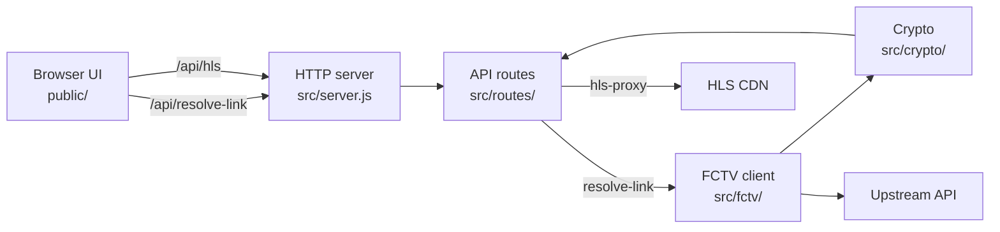

# fctv33-stream-resolver

Self-hosted Node.js **HLS stream resolver** and **m3u8 proxy**. Paste a live sports match page URL, resolve it to a playable stream through a local **REST API**, decode ROT47/AES tokens, rewrite manifests with referer headers, and play back in the browser. Zero npm runtime dependencies.

## How the stream resolver works

- Parses FCTV33 match page URLs into `matchId` and `sportType`
- Calls the upstream data API with MD5-signed requests and protobuf responses
- Builds a tokenized m3u8 URL from ROT47 obfuscation and AES-256-CBC session encryption
- Proxies HLS manifests and MPEG-TS segments with required `Referer` and `Origin` headers
- Serves a small web UI with hls.js playback

## Quick start

```bash
npm start
```

Open `http://localhost:8787`, paste a match page URL from fctv33hd.rest, click **Resolve**.

Requires Node.js 18+ (native `fetch`). Runs as a local **HTTP server** on port `8787` by default (`PORT` env override).

## Architecture



### Resolve flow

1. **Parse URL** — `src/fctv/url.js` extracts sport slug, match ID, and optional `mdata` param
2. **Geo lookup** — `FctvClient.geo()` reads country and continent from `/api/user/info`
3. **Bootstrap signatures** — `/api/common/bs` returns body-signing keys cached per match
4. **Match detail** — signed `/api/match/detail` returns available stream IDs
5. **Stream detail** — `/api/stream/detail` returns obfuscated stream URL and `rb-session` header
6. **Token URL** — `buildTokenUrl()` applies ROT47 decode and AES encryption
7. **Playable link** — proxied `/api/hls?url=…&referer=…` URL returned to the browser

### HLS proxy flow

1. Fetch upstream m3u8 or segment with CDN referer headers
2. Decode CTU segment URLs when `_ctump` / `_ctuph` params are present
3. Rewrite manifest segment URLs to loop back through `/api/hls`
4. Strip PNG-wrapped MPEG-TS payloads when needed

## Project layout

```
src/
  server.js           HTTP entry, static files, local dev
  routes/
    index.js          route dispatcher
    resolve-link.js   GET /api/resolve-link
    hls-proxy.js      GET /api/hls
  fctv/
    config.js         site constants, sport slug map
    client.js         upstream API client
    url.js            match URL parser
    proto.js          protobuf response decoder
  crypto/
    rot47.js          ROT47 decode
    hash.js           MD5 param hash and ordering
    token.js          AES token URL builder
    ctu.js            CTU segment URL decoder
public/
  index.html          UI shell and styles
  app.js              resolve, playback, copy
```

## Streaming API

### `GET /api/resolve-link`

Resolves a match page URL to a proxied m3u8 playback link.

| Param | Required | Description |
| --- | --- | --- |
| `url` | yes | Full match page URL |

**Response**

```json
{
  "name": "Team A vs Team B",
  "playableUrl": "http://localhost:8787/api/hls?url=…&referer=…"
}
```

### `GET /api/hls`

HLS proxy endpoint for m3u8 manifests and MPEG-TS segments.

| Param | Required | Description |
| --- | --- | --- |
| `url` | yes | Upstream m3u8 or segment URL |
| `referer` | yes | Stream iframe referer for CDN access |

Returns rewritten m3u8 manifest or MPEG-TS segment bytes.

## Match URL format

Individual match pages only — not homepage or live listing URLs.

```
https://www.fctv33hd.rest/en/{sport}/{slug}-{matchId}.html
```

Supported sport slugs: `football`, `basketball`, `tennis`, `baseball`, `cricket`, `motorsport`, `rugby`, `american-football`, `aussie-rules`, `hockey`, `badminton`, `volleyball`, `fighting`, `cycling`, `handball`, `others`.

Optional locale prefix: `en`, `zh`, `th`, `vi`, `id`, `pt`, `es`, `tr`, `ru`, `ko`, `ja`.

## Stack

- Node.js ES modules, zero npm runtime dependencies
- Native `fetch`, `node:http`, `node:crypto`
- hls.js 1.5.20 (CDN) for in-browser HLS streaming playback
